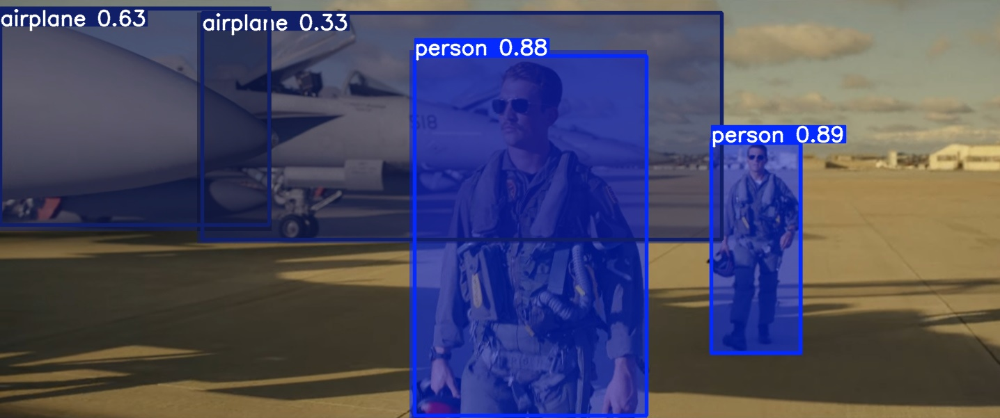

# Internship Task 1: Ultralytics Installation and Basic Inference

## Objective:
Successfully installed the Ultralytics package and verified its core functionality for object detection and segmentation.

## Key Activities:
- Set up a Python virtual environment.
- Installed Ultralytics and its dependencies.
- Utilized scripts like `main.py` and `predict.py` with the `yolo11n.pt` model.

## Outputs:
Processed images included `bus.jpg` and `topgun.jpg`. Output images with detections and segmentation masks were generated in folders such as `my_outputs/bus_prediction/` and `my_outputs/bus_prediction2/`.

**Example Output (Topgun image from Task 1):**

*Description: Object detection on 'topgun.jpg' identifying 'person' and 'airplane'.*

## Conclusion:
Demonstrated initial setup and basic inference capabilities using Ultralytics.
