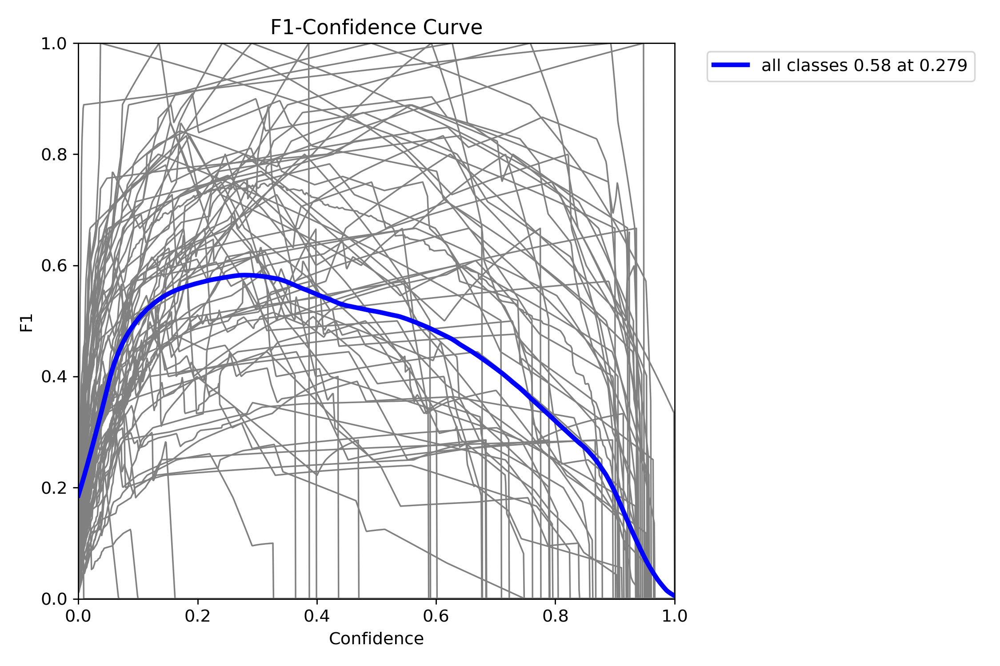
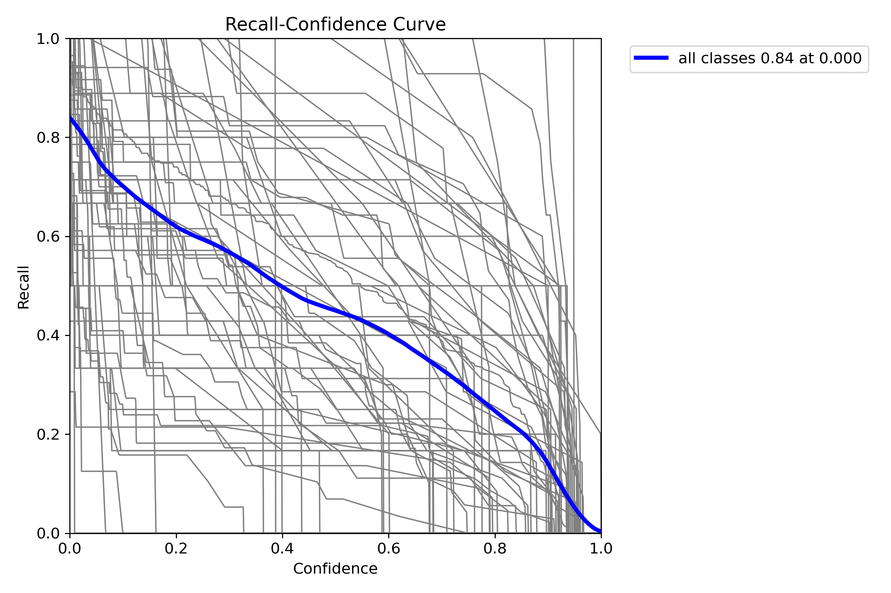
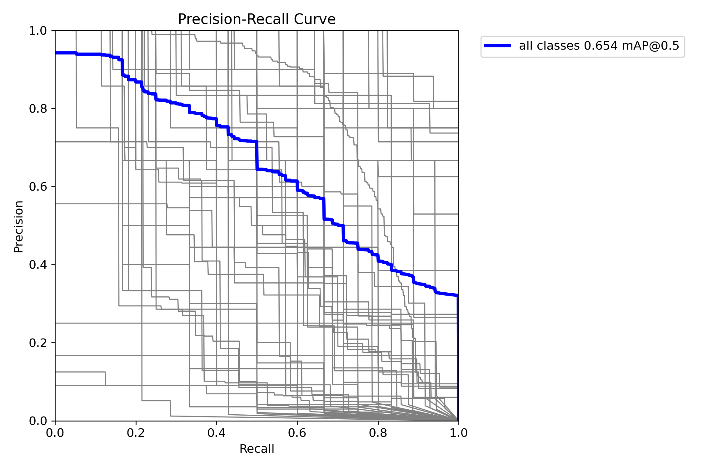
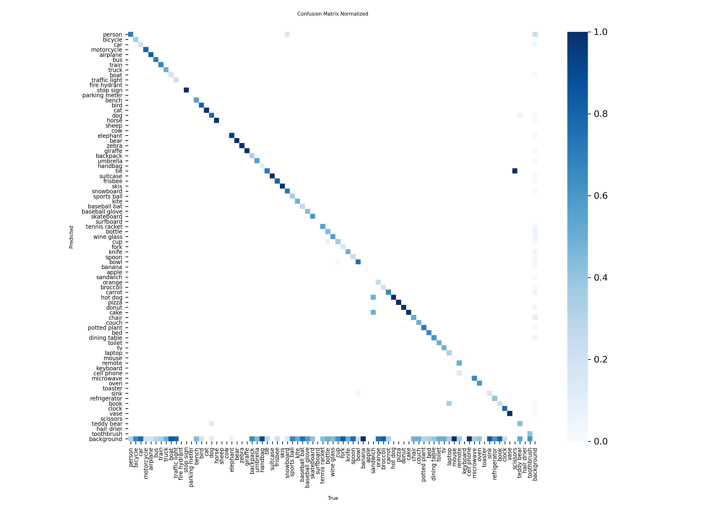
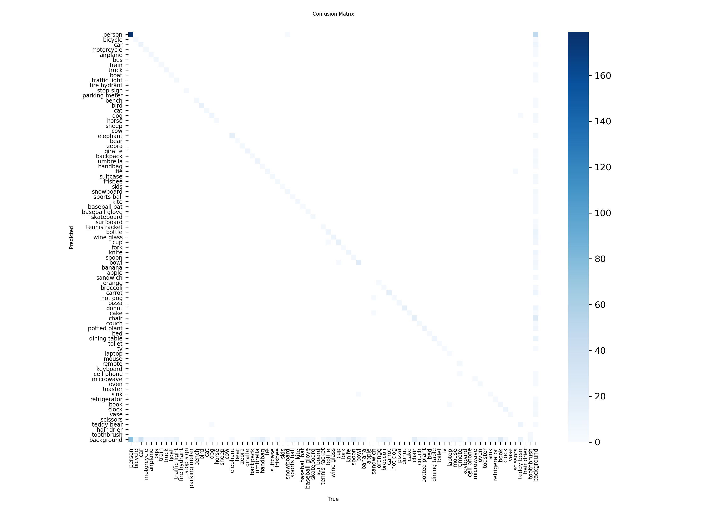
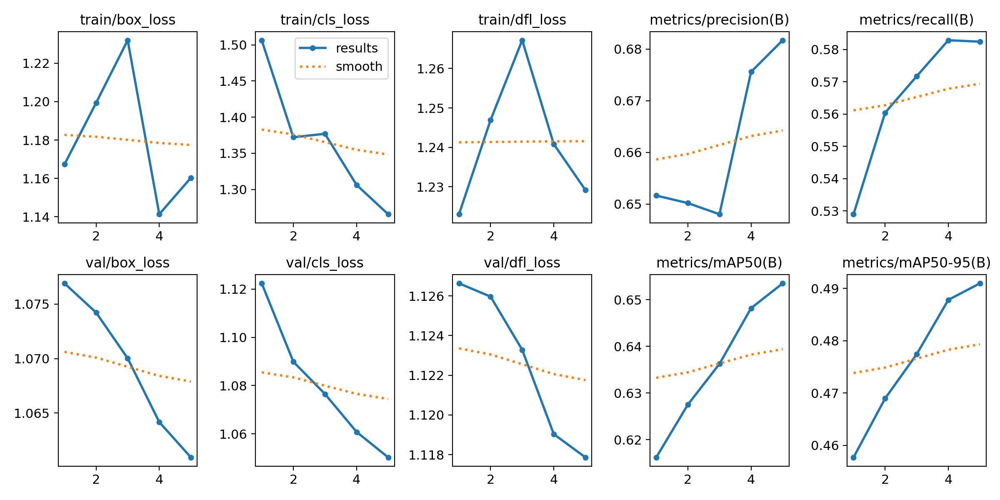
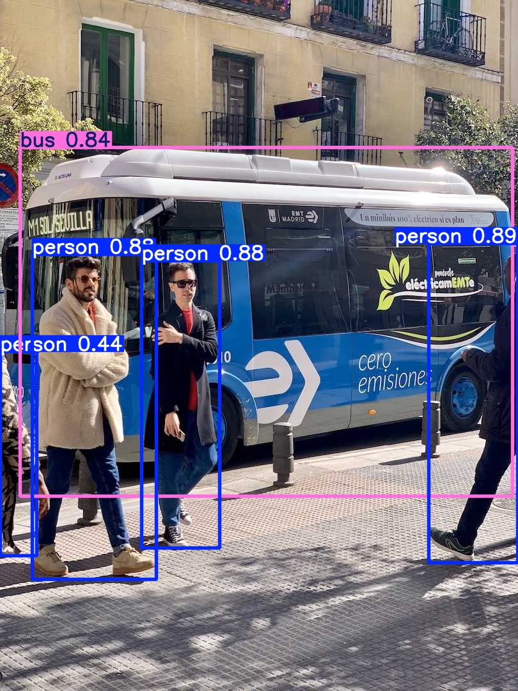
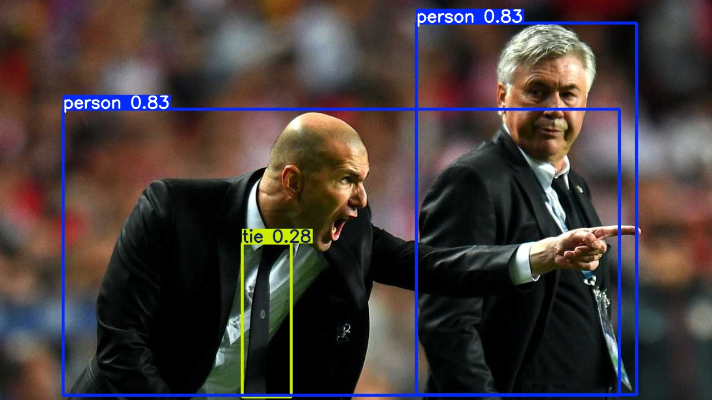
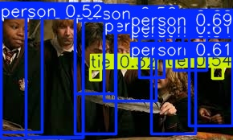

# Internship Task 2: Multi-Image Processing and Performance Metrics Evaluation

## Objective:
Extend object detection and segmentation to multiple images, and evaluate the generated performance metrics from a model training run.

## Multi-Image Processing:
The `detect_multiple.py` script was developed to handle processing multiple images for detection and segmentation. It loads a pre-trained YOLOv8n model and runs inference on all image files found in the `images/` directory.

## Generated Performance Metrics (Model Training):
To obtain crucial performance metrics, a model training run was performed. This involved training a `yolov8n` model on the `coco128` dataset for 5 epochs using the `train_yolo.py` script.

## Key Scripts:
- `detect_multiple.py`: Performs object detection and segmentation on multiple input images.
- `train_yolo.py`: Initiates the model training process to generate performance metrics.

## Generated Metrics and Explanation:
The training process generated several key performance metric plots, which are saved in the `metrics_plots/` directory. These plots are essential for understanding the model's learning and performance characteristics.

### Understanding the Plots:
- You will observe many faint **gray lines** on the F1, Precision, and Recall curves. Each gray line represents the performance metric for a **single, individual object class**. As `coco128` contains **80 different object classes**, the plots show the individual performance for each of these, which can make the background appear busy.
- The prominent **blue line** represents the **"all classes" average** performance (e.g., mean Average Precision or mean Average Recall) across all detected object types. This blue line provides the overall summary of the model's effectiveness, which is the primary focus for overall model evaluation.
- **Note on Legends:** For clarity, due to the large number of classes (80 in COCO128), the plot legends primarily highlight the "all classes" average performance. While individual class lines are visible in gray, their specific labels are omitted from the on-plot legend to maintain readability. Detailed per-class metrics were reported in the terminal output during training and are available in `results.csv`.
- The model was trained for a limited **5 epochs** on a `yolov8n` (nano) model running on a CPU. Therefore, while the curves demonstrate the expected trends, the individual class curves may appear more erratic or "messy" compared to models trained for significantly longer durations or on datasets with fewer classes. The purpose of this task was to successfully generate and interpret these comprehensive metrics, rather than to achieve optimal visual simplicity or a highly converged model.

### Metric Plots:

*   **F1-Confidence Curve:**
    This curve illustrates the F1 score across different confidence thresholds. The F1 score is a balance between precision and recall. A higher F1 score generally indicates a better performing model. The peak of this curve often suggests an optimal confidence threshold for balanced performance.
    

*   **Precision-Confidence Curve:**
    This plot shows how precision (the accuracy of positive predictions) changes as the model's confidence threshold varies. Higher confidence thresholds typically lead to higher precision but potentially lower recall.
    

*   **Recall-Confidence Curve:**
    This curve demonstrates how recall (the model's ability to find all positive instances) changes with different confidence thresholds. Lower confidence thresholds typically lead to higher recall but potentially lower precision.
    

*   **Precision-Recall (PR) Curve:**
    The PR curve plots precision against recall. The Area Under the Curve (AUC-PR), often summarized as mean Average Precision (mAP), is used to evaluate the model's overall performance. A curve closer to the top-right corner indicates better performance.
    

*   **Confusion Matrix:**
    The confusion matrices visually represent the model's classification performance. The normalized matrix (values from 0-1) shows the proportion of predictions, while the non-normalized matrix shows raw counts. The diagonal elements indicate correctly classified instances (True Positives), while off-diagonal elements show misclassifications between classes. Given the short training, some misclassifications or lower recall for certain classes are expected.
    
    

*   **Training Results Plot (Loss and Metrics over Epochs):**
    The `results.png` typically provides a visual summary of various metrics, including loss curves (box_loss, cls_loss, dfl_loss) and performance metrics (mAP, precision, recall) over epochs. A decreasing trend in loss curves signifies that the model is learning and improving its predictions.
    

## Inference Outputs:
Here are some examples of images processed by the `detect_multiple.py` script, demonstrating object detection and segmentation.

*Description: Object detection and segmentation on 'bus.jpg', identifying a bus and several persons.*

*Description: Object detection and segmentation on 'zidane.jpg', identifying persons and a tie.*

*Description: An example showing detection results on 'harrypotter.jpg'.*

*Description: An example showing detection results on 'hpApple.jpg'.*

*Description: An example showing detection results on 'hpp.jpg'.*

## Conclusion:
The successful generation and evaluation of these metrics, combined with multi-image inference, are crucial for understanding the model's performance and identifying areas for potential improvement in object detection tasks. This exercise demonstrates the foundational steps in training and assessing a deep learning model for computer vision.
